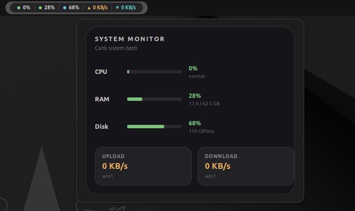
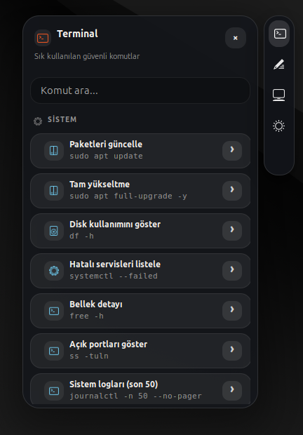
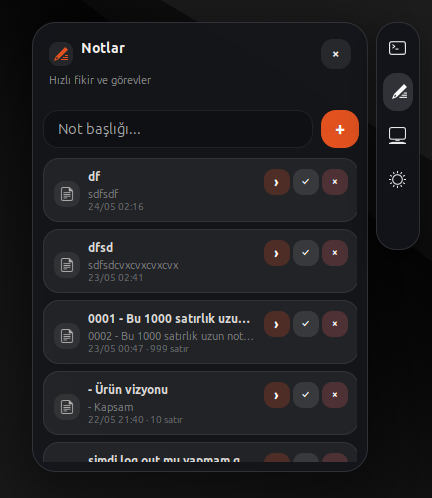
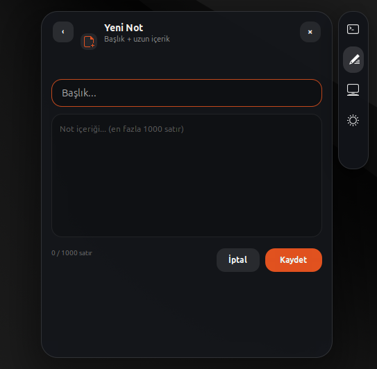
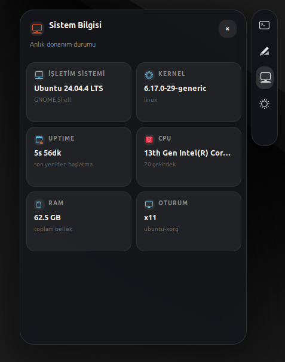
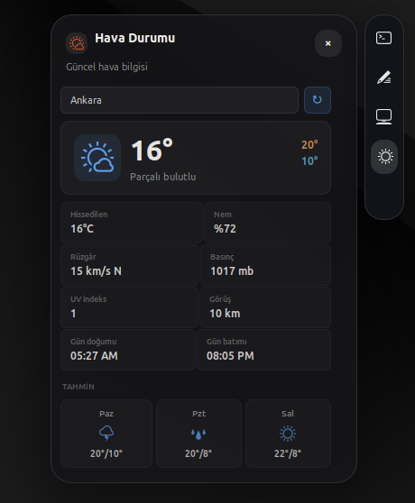

# CAL Extensions

**CAL Extensions**, Ubuntu/GNOME masaüstü için geliştirdiğim hafif bir GNOME Shell eklentisidir.

Amacı masaüstünü kalabalıklaştırmadan birkaç pratik aracı tek yerde toplamak: üst barda küçük bir sistem monitörü, sağ kenarda terminal kısayolları, hızlı notlar, sistem bilgisi ve hava durumu panelleri.

Bu proje şimdilik **yerel kurulum / public preview** aşamasındadır. Ana test ortamım Ubuntu 24.04 LTS ve GNOME Shell 46'dır.

<p align="center">
  
  
  
  
</p>

---

## Ekran görüntüleri

<p align="center">
  
</p>

<table>
  <tr>
    <td width="50%" align="center">
      <br>
      <strong>Terminal kısayolları</strong>
    </td>
    <td width="50%" align="center">
      <br>
      <strong>Hızlı notlar</strong>
    </td>
  </tr>
  <tr>
    <td width="50%" align="center">
      <br>
      <strong>Yeni not</strong>
    </td>
    <td width="50%" align="center">
      <br>
      <strong>Sistem bilgisi</strong>
    </td>
  </tr>
</table>

<p align="center">
  <br>
  <strong>Hava durumu</strong>
</p>

---

## Neler var?

- **Üst bar sistem monitörü**: CPU, RAM, disk ve ağ trafiğini küçük bir alanda gösterir.
- **Terminal kısayolları**: Sık kullanılan Linux komutlarını hızlıca bulup çalıştırmayı kolaylaştırır.
- **Hızlı notlar**: Masaüstünden kısa not veya görev yazmak için basit bir panel sunar.
- **Sistem bilgisi**: Dağıtım, kernel, oturum, işlemci ve bellek bilgilerini gösterir.
- **Hava durumu**: Seçilen şehir için temel hava durumu bilgisini gösterir.
- **Ayarlar ekranı**: Modülleri açıp kapatabilir, yenileme aralıklarını ve panel davranışlarını değiştirebilirsin.
- **Sağ rail kontrolleri**: Rail altındaki ayarlar düğmesiyle ayarları açabilir, gridli tutma alanıyla paneli yukarı/aşağı taşıyabilirsin.

Eklenti mevcut dock düzenine dokunmaz. Sağ kenarda katlanabilir bir rail paneli olarak çalışır.

---

## Kurulum

Önce repoyu indir:

```bash
git clone https://github.com/alibedirhan/CAL-EXTENSIONS.git
cd CAL-EXTENSIONS
```

Yerel kurulum scriptini çalıştır:

```bash
bash scripts/install_local.sh
```

Sonra eklentiyi etkinleştir:

```bash
gnome-extensions enable ubuntu-desktop-tools@cal
```

Ayarlar penceresini sağ rail altındaki dişli simgesinden açabilirsin. Terminalden açmak istersen:

```bash
gnome-extensions prefs ubuntu-desktop-tools@cal
```

Wayland oturumunda eklentinin görünmesi için çıkış yapıp tekrar giriş yapman gerekebilir. X11 oturumunda genellikle `Alt + F2`, `r`, `Enter` yeterlidir.

---

## Güncelleme

```bash
git pull
bash scripts/install_local.sh
gnome-extensions disable ubuntu-desktop-tools@cal
gnome-extensions enable ubuntu-desktop-tools@cal
```

Wayland kullanıyorsan güncellemeden sonra çıkış/giriş yapmak daha sağlıklı olur.

---

## Kaldırma

```bash
bash scripts/uninstall_local.sh
```

Elle kaldırmak istersen:

```bash
gnome-extensions disable ubuntu-desktop-tools@cal
rm -rf ~/.local/share/gnome-shell/extensions/ubuntu-desktop-tools@cal
```

---

## Sorun giderme

Durumu kontrol etmek için:

```bash
bash scripts/status_extension.sh
bash scripts/diagnose_install.sh
```

Rail/drag davranışı gibi kısa testler için 60 saniyelik log paketi oluşturabilirsin:

```bash
bash scripts/collect_drag_logs.sh
```

Log paketi proje içindeki `logs/` klasörüne yazılır.

GNOME Shell loglarını izlemek için:

```bash
journalctl /usr/bin/gnome-shell -f --no-pager | grep -Ei "cal|extension|error|js|gio|st\."
```

Eklenti masaüstünde sorun çıkarırsa acil kapatma scripti:

```bash
bash scripts/emergency_disable.sh
```

Daha detaylı notlar için [`docs/04_SORUN_GIDERME_TR.md`](docs/04_SORUN_GIDERME_TR.md) dosyasına bakabilirsin.

---

## Uyumluluk

Şu an ana test ortamı:

- Ubuntu 24.04 LTS
- GNOME Shell 46
- X11 ve Wayland oturumları

GNOME 47/48 hedeflenir, fakat her dağıtımda aynı davranış garanti edilmez. Fedora, Debian, Arch veya openSUSE gibi GNOME tabanlı dağıtımlarda test sonuçları geldikçe uyumluluk notları güncellenecek.

Teknik UUID bilinçli olarak korunmuştur:

```text
ubuntu-desktop-tools@cal
```

Bu, mevcut yerel kurulumların ve GNOME ayar şemasının gereksiz yere kırılmaması için tercih edildi.

---

## Güvenlik ve gizlilik

- Notlar yerel olarak saklanır.
- Hesap girişi, telemetri veya bulut senkronu yoktur.
- Terminal panelinde tehlikeli komut desenleri engellenmeye çalışılır.
- Hava durumu modülü etkinse, seçilen şehir hava durumu servisine gönderilebilir.

Detaylar: [`docs/05_GUVENLIK_GIZLILIK_TR.md`](docs/05_GUVENLIK_GIZLILIK_TR.md)

---

## Geliştirme

Statik kontroller:

```bash
bash scripts/check_static.sh
```

Yerel kurulum:

```bash
bash scripts/install_local.sh
```

Release paketi üretmek için:

```bash
bash scripts/package_release.sh
```

Mimari notlar ve bakım rehberi `docs/` klasöründe tutulur. En faydalı dosyalar:

- [`docs/01_KURULUM_TR.md`](docs/01_KURULUM_TR.md)
- [`docs/03_AYARLAR_TR.md`](docs/03_AYARLAR_TR.md)
- [`docs/06_MIMARI_TR.md`](docs/06_MIMARI_TR.md)
- [`docs/08_TEST_RELEASE_CHECKLIST_TR.md`](docs/08_TEST_RELEASE_CHECKLIST_TR.md)
- [`docs/14_COMPATIBILITY_MATRIX_TR.md`](docs/14_COMPATIBILITY_MATRIX_TR.md)

---

## Durum

Bu sürümde temel korunarak küçük kullanım ve bakım iyileştirmeleri yapıldı. Sağ rail kontrolleri korunuyor; tanılama scriptleri daha sakin ve doğru rapor veriyor. Hava durumu modülü servis geçici olarak yanıt vermediğinde eklentiyi bozmak yerine kontrollü biçimde fallback davranışı gösteriyor.

Proje halen gelişiyor. Büyük değişikliklerden önce çalışan davranışı bozmamak ana öncelik.

---

## Lisans

GPL-3.0. Detaylar için [`LICENSE`](LICENSE) dosyasına bakabilirsin.
